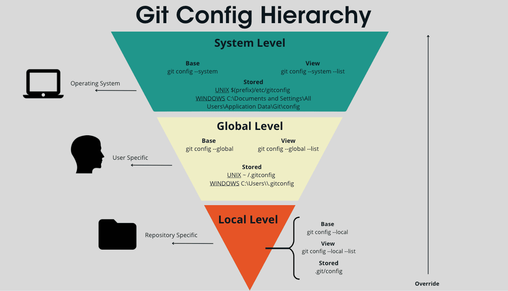

# Заголовок 1
## Заголовок 2
### Заголовок 3
#### Заголовок 4
##### Заголовок 5
###### Заголовок 6


Заголовок 1
=
Заголовок 2
-


* маркированный список
- маркерованный список
+ маркерованный список


1. Пункт спсика
2. Пункт списка
3. Пункт списка


---
1. Пункт спсика
    * маркированный список
    * маркерованный список
    * маркерованный список


*Перенос* **строки** ***всегда*** 


`
a =1
b = 2
c = 3
`


```
a =1
b = 2
c = 3
```


>какая-то цитата  
Новый текст - дле переноса строки использовались два пробела в конце строки: какая-то цитата


[текст ссылки](https://github.com/AlexeySmirnov-777/lesson_readmy)


[](https://github.com/AlexeySmirnov-777/lesson_readmy)


поле   | значение | индекс
:----- |:--------:| -----:
шина   | м2       | 1
мина   | к2       | 2
рина   | рм2      | 5


